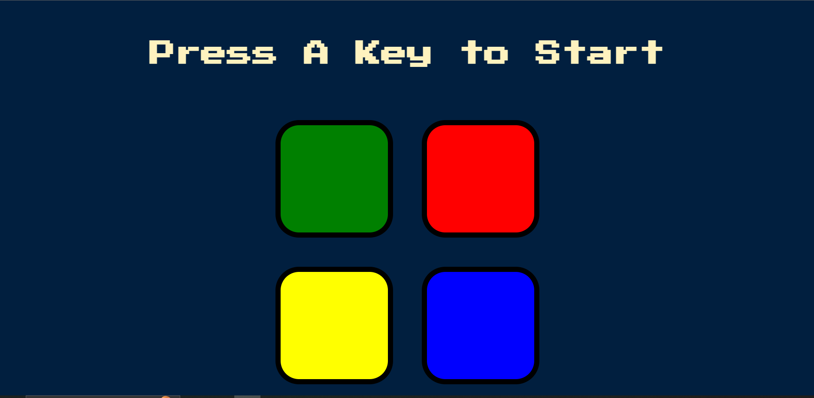

# Simon Game

A modern implementation of the classic Simon memory game using **HTML**, **CSS**, and **jQuery**.

## Introduction
The Simon Game is a fun memory-based game that challenges players to repeat a sequence of colors and sounds. Each level adds a new step to the sequence, requiring the player to remember and repeat it correctly. This project demonstrates the use of **jQuery** for interactivity, animations, and event handling.

## Features
- Dynamic color and sound sequences.
- Incremental difficulty with each level.
- "Game Over" effect and restart functionality.
- Fully responsive design.

## How to Play
1. Press any key to start the game.
2. Follow the pattern of colors and sounds displayed on the screen.
3. Repeat the sequence by clicking on the corresponding buttons.
4. The game adds a new step to the sequence after each successful attempt.
5. If you click the wrong button, the game ends and displays a "Game Over" message.
6. Press any key to restart the game.

## Setup and Usage

### Prerequisites
- A modern web browser (Google Chrome, Mozilla Firefox, etc.)
- Basic knowledge of HTML, CSS, and JavaScript 

### Steps
1. Clone or download the repository.
   ```bash
   git clone https://github.com/ChirayuC01/simonGame_jQuery.git
   ```
2. Open the `index.html` file in your browser.
3. Play the game and enjoy!

### File Structure
```
project-folder
|-- index.html        # Main HTML file
|-- styles.css         # Styling for the game
|-- game.js            # Game logic implemented in JavaScript
|-- sounds/            # Folder containing sound files for each color
```

## Technologies Used
- **HTML**: Markup structure of the game.
- **CSS**: Styling and layout of the game interface.
- **JavaScript (jQuery)**: Game logic and interactivity.

## Screenshots



